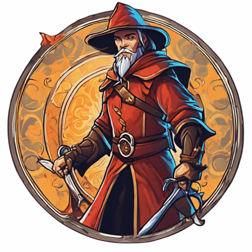

<div style="margin-left: 15px; float: right;">
  
</div>

# Warder

Library to manage ranges of arbitrary type.

[](https://github.com/sustema-ag/warder/actions/workflows/branch_main.yml)
[](https://hex.pm/packages/warder)
[](https://hex.pm/packages/warder)
[](https://github.com/sustema-ag/warder/blob/main/LICENSE)
[](https://github.com/sustema-ag/warder/commits/master)
[](https://coveralls.io/github/sustema-ag/warder?branch=main)

## Usage

```elixir
Range.adjacent?(Range.new!(1, 100), Range.new!(100, 200))
# => true

Range.contains?(Range.new!(1, 100), Range.new!(20, 30))
# => true

Range.overlap?(Range.new!(1, 100), Range.new!(200, 300))
# => false

# And many more, check the docs :)
```

### Ecto

`Warder.Range` and `Warder.Multirange` are [Parameterized `ecto` Types](https://hexdocs.pm/ecto/3.11.2/Ecto.ParameterizedType.html).

## Installation

The package can be installed by adding `warder` to your list of dependencies in
`mix.exs`:

```elixir
def deps do
  [
    {:warder, "~> 0.1.0"}
  ]
end
```

The docs can be found at <https://hexdocs.pm/warder>.

